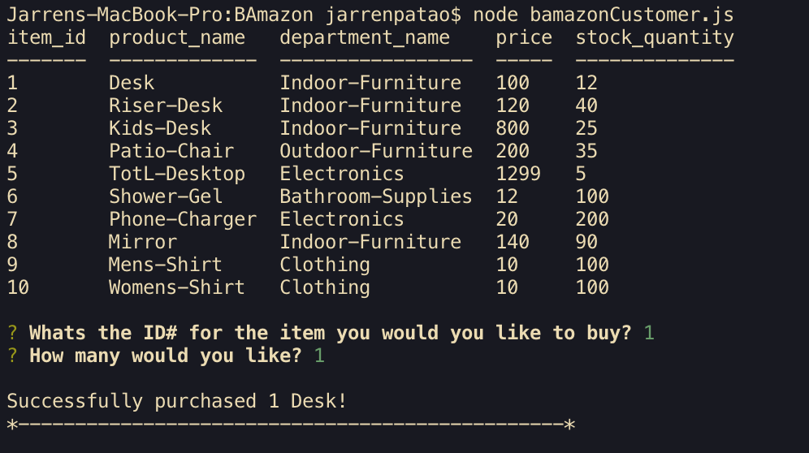
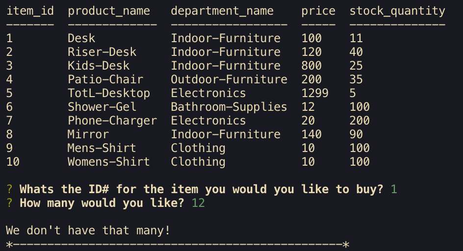
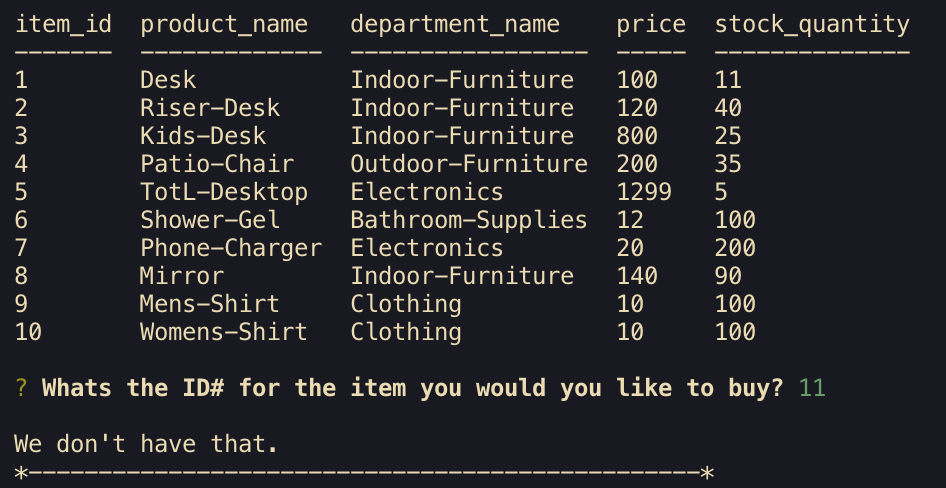

# BAmazon
Creating an SQL database to recall inventory that has been placed both dynamically and through persistent data.

Here is the successful purchase.

This is the unsuccessful: (lack of inventory) purchase.

This is the unsuccessful: (no item found) purchase.

